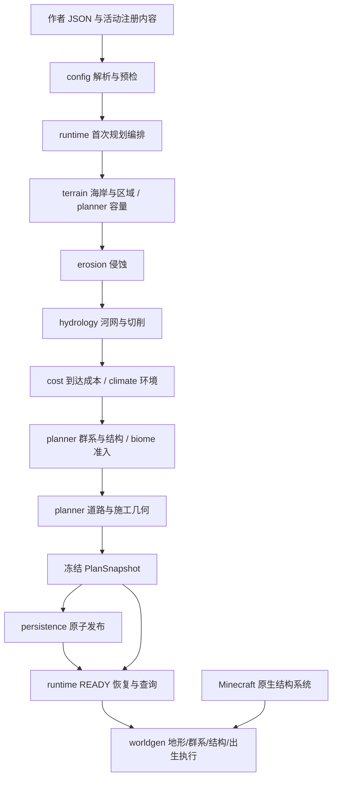
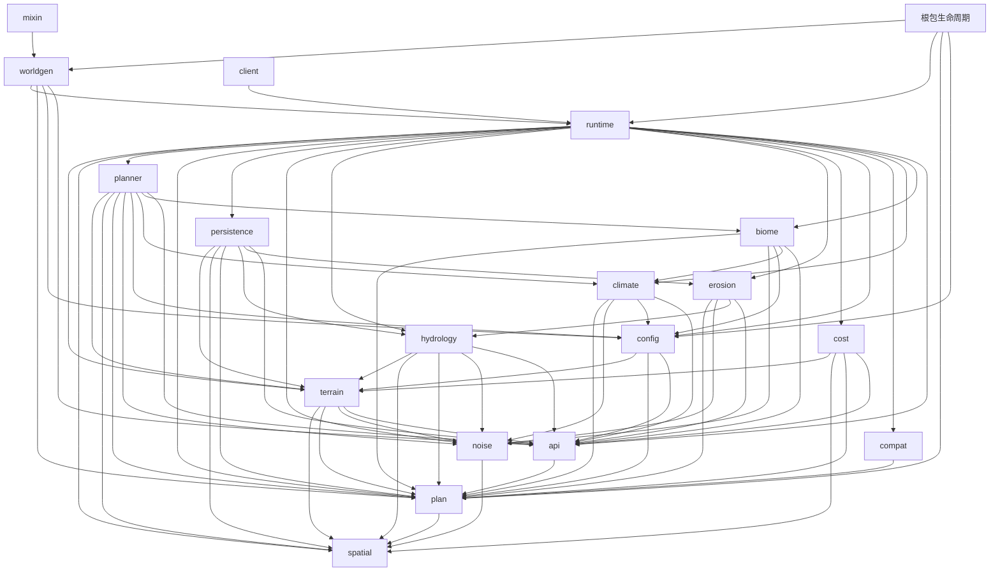

# 架构概览

这里回答系统如何分层、模块如何协作，以及首次定位代码应从哪里进入。

AdventureWorldGen 在主世界区块生成前完成宏观编排。
作者配置是输入，冻结计划向 worldgen 提供地形、群系和出生查询。
结构规划只保留宏观元数据；worldgen 将锚点转成结构起点，Minecraft 管线按区块放置结构。
默认 [普通世界预设](../../neoforge/src/main/resources/data/minecraft/worldgen/world_preset/normal.json)
将主世界接到自定义生成器；下界和末地仍使用各自的原版生成器。

## 数据流

箭头表示主要数据流，不等同于 Java 包依赖。
首次规划直接复用已构造对象，恢复则从快照重新组装查询对象；两者共用公式。
`plan` 包提供共享词汇；整体快照在 `persistence`，可执行计划在 `runtime`。

## 依赖方向

下图按当前生产源码的本项目包引用展示完整依赖，箭头为“调用方依赖被调用方”。
`root` 表示根包生命周期入口；外部 Minecraft / NeoForge 依赖由 [依赖约束](invariants.md#dependency) 单独限定。
可先沿 runtime → planner / persistence → 各领域阅读，再看共享数据包。

`runtime` 是无 Minecraft 依赖的会话与组装层，并非只依赖 `plan` 的叶子查询包。
它实际依赖规划、领域计算与持久化；`GeneratedAdventurePlan` 也保留对 filler 等查询实现的引用。
各领域的职责与入口见下表及主题文档，禁用方向见 [依赖约束](invariants.md#dependency)。

## 关键入口

| 问题 | 实现入口 | 进一步阅读 |
|---|---|---|
| 配置怎样进入游戏 | [ProfileReloadListener](../../neoforge/src/main/java/io/github/luoyan/adventureworldgen/worldgen/ProfileReloadListener.java) | [生命周期](pipeline.md#reload) |
| 世界什么时候开始规划 | [AdventureEvents](../../neoforge/src/main/java/io/github/luoyan/adventureworldgen/AdventureEvents.java) | [运行时](../systems/runtime-worldgen.md) |
| 哪一步构造什么 | [RuntimePlanner](../../neoforge/src/main/java/io/github/luoyan/adventureworldgen/runtime/RuntimePlanner.java) | [首次规划](pipeline.md#initial) |
| 游戏查询什么 | [AdventurePlanView](../../neoforge/src/main/java/io/github/luoyan/adventureworldgen/api/AdventurePlanView.java) | [冻结计划 v4](../reference/plan-v2.md) |
| 如何写入区块 | [AdventureChunkGenerator](../../neoforge/src/main/java/io/github/luoyan/adventureworldgen/worldgen/AdventureChunkGenerator.java) | [区块执行](../systems/runtime-worldgen.md#chunk) |

## 能力范围

系统编排宏观位置；[道路系统](../systems/roads.md) 验证所选目的地的冻结道路连通，不证明玩家首次遇见顺序或任意第三方内容下的通行性。
已接管结构在规划锚点对应的起点区块执行，并抑制同 ID 的随机候选；Java 结构自行决定最终原点。
资源缺失、原生定位失败或超出引用范围会明确失败，规划锚点本身不证明所有第三方结构均可执行。
冒险等级和面积的保证范围见 [规划约束分层](../systems/planning.md#constraints)。
群系查询当前是水平归属；表层与地物使用 Minecraft 内容，不提供垂直群系规划。
独立工具、测试伴随模组与生产资源的边界见 [测试指南](../development/testing.md)。
