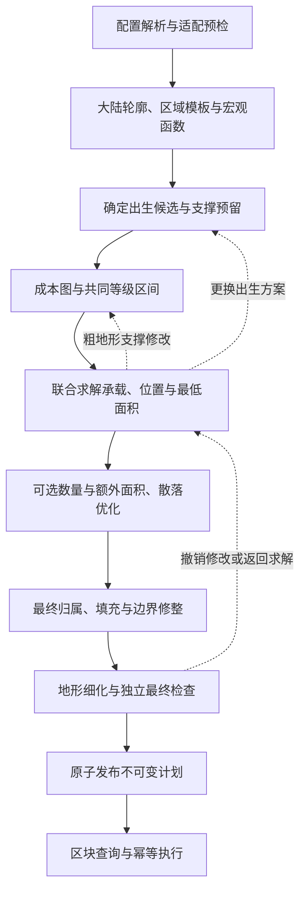

# 生成流程

[文档总览](../README.md) · [设计原则](设计原则.md) · 下一步：[作者配置](配置说明.md)

本文说明阶段依赖、输入输出与回退范围。海岸、区域模板与粗细地形、成本图、联合编排和运行时契约已确定；当前河网、海洋与侵蚀实现及验证边界见 [r6 修复说明](地形修复-r6.md)。保留原文件路径，不以文件名中的“候选”判断每个阶段的状态。

本文导航：[总流程与阶段产物](#pipeline) · [联合阶段的先后关系](#joint-placement) · [状态失效与回退](#cost-recalculation) · [地形生成与剩余接入边界](#terrain-candidate)。

## 1．总流程与阶段产物

图中为阶段依赖；搜索内部的撤销、候选扩展和数量分支见[主算法控制流程](群系种子与结构位置选择算法.md#pseudocode)。所有重试受累计预算限制。

| 阶段 | 必要输入 | 产物与完成条件 | 定义位置 |
|---|---|---|---|
| 1. 解析与预检 | 作者 JSON、注册表、适配器能力 | 规范化需求、稳定 ID、有效数量下界；静态错误或不支持内容已报告 | [配置契约](配置说明.md#top-level)、[适配接口](运行时与结构适配.md#spawn-adapter) |
| 2. 大陆与粗地形 | 种子、半径、出生预留、模板与水体数据 | 固定区域与模板、连续宏观函数及粗采样；主要河口已接入 | [海岸算法](海岸轮廓生成算法.md)、[粗细地形算法](粗细地形生成算法.md) |
| 3. 出生候选 | 粗地形、出生需求、完整结构准备结果 | 玩家脚底、原点和旋转、入口、保护范围；出生支撑整平已提交 | [出生契约](运行时与结构适配.md#spawn-adapter) |
| 4. 成本与等级 | 固定出生位置、同版本粗地形、海岸样本 | 按需采样双向边成本、完整成本图、可达海岸中位数和共同等级区间 | [成本模型](生成器参数与执行约定.md#cost-model)、[等级区间](群系种子与结构位置选择算法.md#level-cost) |
| 5. 联合求解 | 需求、适配信息、成本区间、候选域 | 合法数量向量、承载关系、种子、结构位置及最低面积分配 | [联合搜索](群系种子与结构位置选择算法.md#search)、[最低面积](群系种子与结构位置选择算法.md#minimum-area) |
| 6. 有界优化 | 已取得的可行布局 | 上界内可选实例、合法额外面积与共同散落布局；失败保留合法方案 | [优化顺序](群系种子与结构位置选择算法.md#optimization) |
| 7. 最终归属 | 可行地块、填充池 | 无损细分到最终 4 格子，填充剩余域并合法修整边界 | [形状](生成器参数与执行约定.md#shape-profile)、[填充](生成器参数与执行约定.md#filler) |
| 8. 细化与检查 | 固定布局、海岸、支撑预留、地形方案 | 最终地形；出生、承载、等级、数量、间距、面积和归属通过独立复查 | [最终检查](群系种子与结构位置选择算法.md#validation)、[验收](实施与验收指南.md#acceptance) |
| 9. 发布与执行 | 全部检查通过的计划 | 原子发布 `READY` 快照；不同区块顺序查询同一份计划并按部件幂等提交 | [运行时契约](运行时与结构适配.md#persistence) |

联合阶段内部可维护局部可行状态，但只有完整最终检查通过才能发布成功计划；填充或细化失败仍须回退。

## 2．联合阶段的先后关系

出生实例和玩家位置先于成本图固定。必须群系每条一片，结构从有效数量下界起展开；若下界方案失败，按数量向量规则继续搜索，尤其不能遗漏最大间距需要增加中间实例的情况。

承载关系、种子、结构原点与旋转、保护范围和最低面积共同求解，不在进入空间分配前永久锁死其中一项。结构预留、最低面积和必要宏观连接优先；它们成立后再尝试可选数量、额外面积与散落优化。

优化会移动对象时，重新求解受影响归属并检查全部硬约束。最终边界修整统一在 4 格子表示上执行；填充与必须地块保持独立统计。完整步骤、公式和伪代码只在[联合算法](群系种子与结构位置选择算法.md)维护。

## 3．状态失效与回退

| 发生的变化 | 必须更新或撤销的内容 |
|---|---|
| 更换出生方案 | 以新玩家位置重建成本图、海岸参考、等级区间及候选合法性；同地形版本的普通网格边缓存可复用 |
| 结构支撑整平改变粗高度或通行连接 | 提交独立地形版本，旧边缓存失效，整图重算成本；更新所有对象的区间和兼容域；撤销候选同时撤销补丁 |
| 移动种子、结构或改变承载关系，粗地形未变 | 沿用成本图查询新位置；重新检查交集、占地、间距和受影响的面积分配 |
| 只改群系标签或细节，粗表示未变 | 沿用成本图；仍需满足明确的出生、结构和最终归属要求 |
| 可选数量、额外面积或优化失败 | 撤销本次修改，恢复已保存合法状态，保留预算给最终检查 |
| 填充或最终复查失败 | 撤销有问题的修改或在预算内换分支；不能发布未检查的回退状态 |

第一版仅允许[有限支撑整平](生成器参数与执行约定.md#terrain-repair)，不启用搬移山脉、开山口或修改海岸的通用修复。若后续版本主动改变岸线，须从海岸检查开始更新掩膜、成本、等级参考及全部受影响布局，不能局部改线后保留旧计划。

单次贪心失败、精度不足、预算耗尽与已穷尽域无解分别诊断，完整分类见[终止与失败](群系种子与结构位置选择算法.md#termination)。

## 4．地形生成与剩余接入边界

区域布点、模板选择、共享边界混合和宏观／细节分层已按[粗细地形生成算法](粗细地形生成算法.md)采用。粗阶段已经形成丘陵、山体和主要谷地；运行时逐方块查询同一宏观函数，并叠加受限细节。成本图连接中间点直接查函数，不用网格端点插值代替。

地形区域与群系地块分开；温湿度若辅助未指定群系分配，必须服从作者约束。草色、植被、美化与道路扩展不由本阶段新增实现，但已有群系外观兼容仍需验收。

当前顺序为大陆与区域地形、陆地侵蚀、河网及河湖水位约束、水文地形、成本图和联合规划。实际外海接入原版海洋密度图，规划期海床保留宏观近似。主要河谷和水体在成本图前形成并提供几何查询；当前实现没有移植完整上游水文系统或通用洼地求解。算法来源见[FreeTerraForged 手册](FreeTerraForged_地形生成移植算法手册.md)，当前适配范围见 [r6 修复说明](地形修复-r6.md)。

若复用源码，地表规则中的河流填水、瀑布构造以及气候步骤中的地形参数修正需要识别并提取。会改变宏观地形的侵蚀必须进入规划前的地形版本；精细阶段不新增精细通行反馈。后续依赖见[待讨论问题](待讨论问题.md#open-items)与[实施顺序](实施与验收指南.md#implementation-order)。
